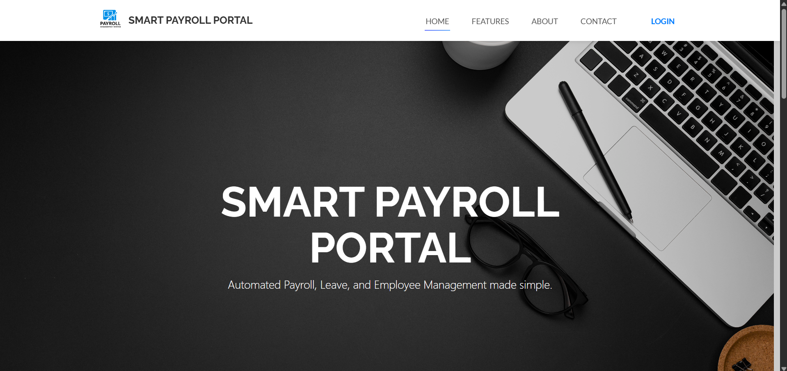
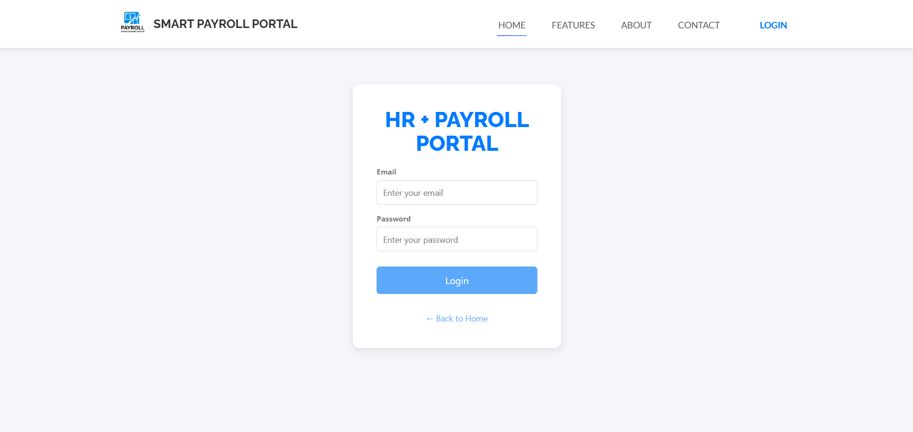
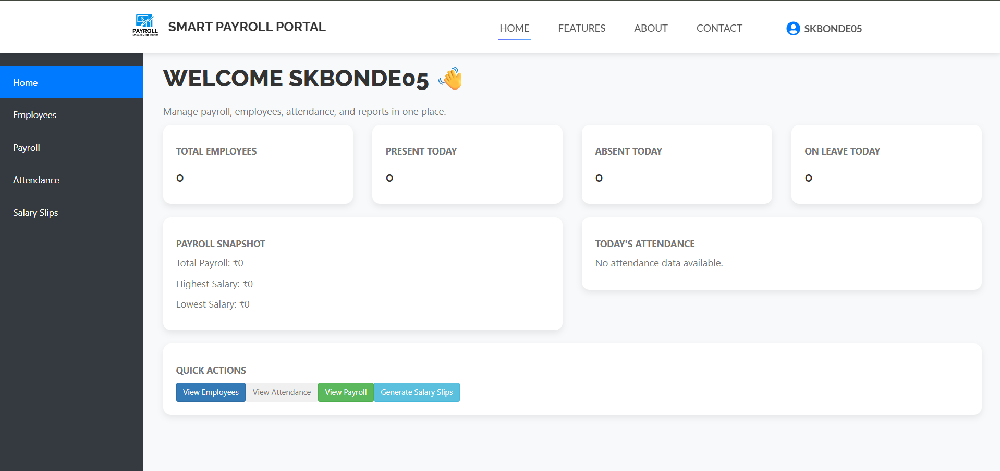
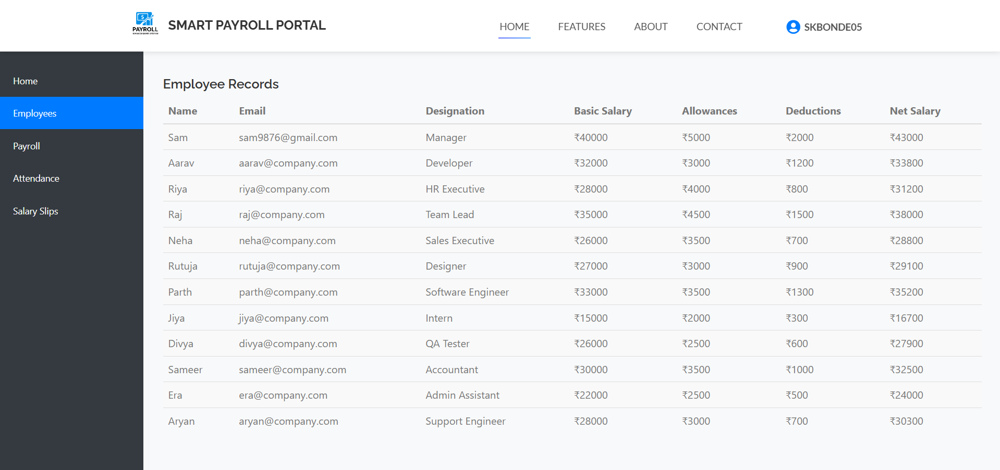
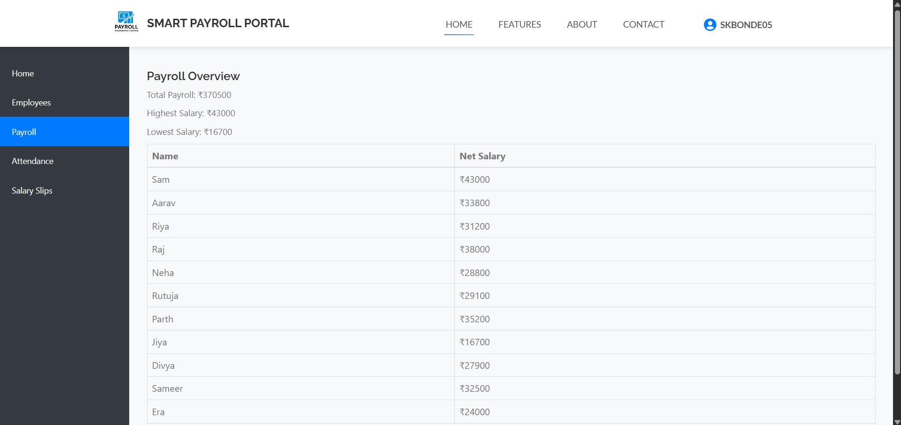
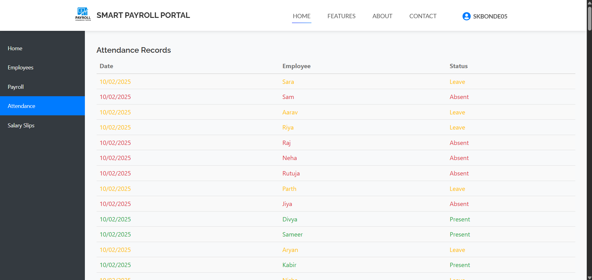
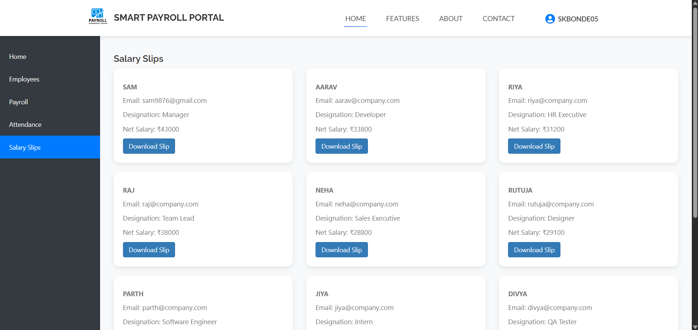

# 📊 Smart Payroll System  
A complete **HR & Payroll Management Portal** built using the **MERN Stack**.  
This system helps organizations manage employees, attendance, salary calculations, payroll reports, and salary slip generation — all in one place.

---

## 🚀 Features

### 👤 Employee Management
- Add, view, and manage employee records  
- Store salary structure (basic, allowances, deductions)  
- Auto-calculate **net salary**  

### 🕒 Attendance Management
- Track daily attendance  
- Status: **Present / Absent / Leave**  
- Attendance table sorted by latest date  

### 💰 Payroll System
- Auto-calculate monthly payroll  
- Highest & lowest salary summary  
- Total payroll overview  
- Generate professional **PDF salary slips**  

### 📄 Salary Slip Generation
- Download salary slip as a **PDF**  
- Uses `jsPDF` library  
- Clean layout with all salary details  

### 📊 Dashboard Overview
- Total employees  
- Present / Absent / Leave count  
- Payroll snapshot  
- Today’s attendance summary  
- Quick navigation buttons  

### 📱 Fully Responsive UI
- Modern dashboard layout  
- Sidebar navigation  
- Mobile-friendly design  

---

## 🛠️ Tech Stack

### **Frontend**
- React.js  
- Axios  
- Bootstrap  
- jsPDF (PDF generation)  

### **Backend**
- Node.js  
- Express.js  
- MongoDB (Atlas/local)  

### **Tools**
- Git & GitHub  
- Postman  
- Render / Vercel (deployment)  

---

## 📂 Project Structure

```bash
Smart-Payroll-System/
│
├── backend/
│   ├── models/
│   ├── routes/
│   ├── controllers/
│   ├── data/
│   ├── server.js
│   ├── .env.example
│   └── package.json
│
├── frontend/
│   ├── src/
│   ├── public/
│   ├── .env.example
│   └── package.json
│
├── README.md
└── .gitignore

📌 Screenshots







